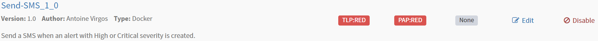
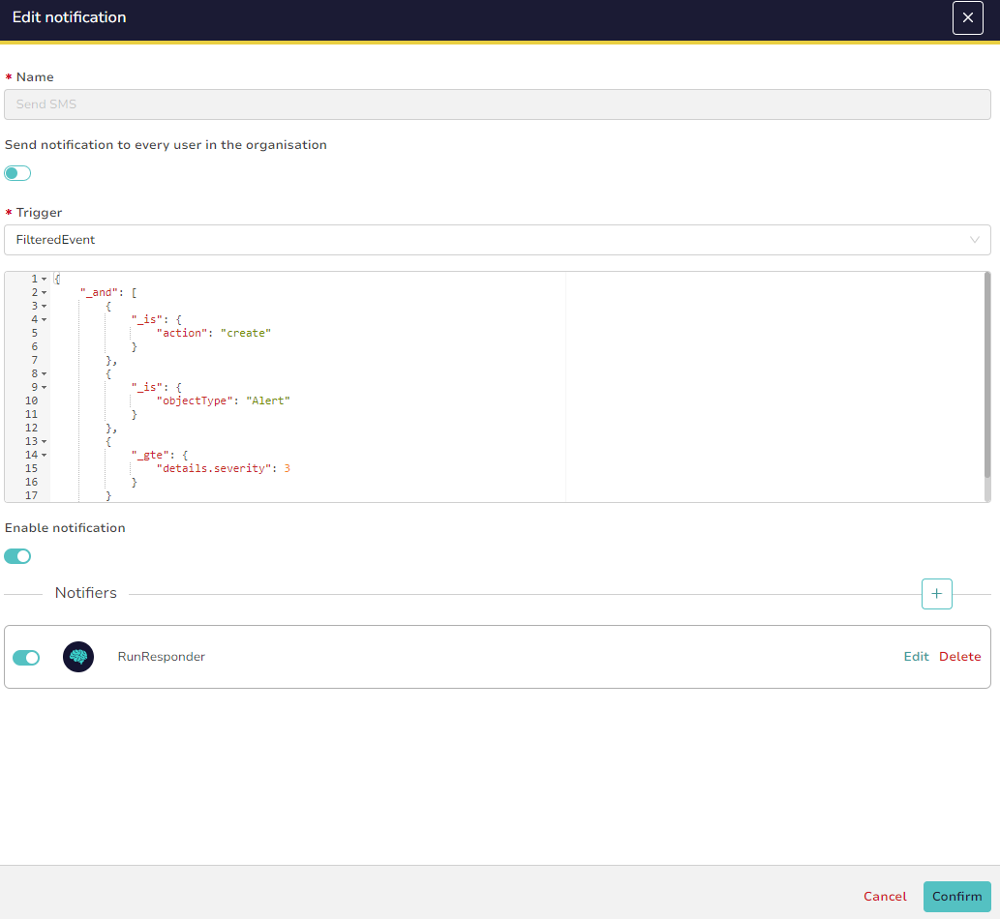

# send-SMS

## Overview

Cortex responder to send an SMS if a `High` or `Critical` TheHive alert has been created.



The SMS is sent using the `send-SMS.pl` script. The SMS messages are in the following format:

```
[On-call duty]
TheHive alert { <severity> } : <alert-title>

https://<thehive-url>/alerts/<alert-id>/details
```

## Prerequisites

- Cortex on your TheHive instance
- TheHive API key of your service account
- SMS server(s)

## Usage

In the Python program `send-SMS.py`, update the following global variables:

```py
# phone number to which the SMS will be sent
SMS_PHONE_NUMBER = "<sms-phone-number>"
# TheHive API instance URL
THEHIVE_API_URL = "https://<thehive>/api/v1"
```

In the Perl script `send-SMS.pl`, add your SMS servers here:

```pl
my @servers = ("sms-server1", "sms-server2");
```

And, for 2 variables, replace "******" with the password used to establish the connection:

```pl
my $path = "/SMS?pwd=******&number=$number&notification=1&text=";

my $url = "http://$server:$port/SMS?pwd=******&number=$number&notification=1&text=$msg";
```

## Configuration

### Execution mode

Responder triggering should be configured to run automatically when specific conditions are met to send SMS notifications.

On your TheHive platform, go to "**Organization**" > "**\<organization-name>**" > "**Notifications**" menu and create a notification named "Send SMS". Add the following data:

```json
{
    "_and": [
        {
            "_is": {
                "action": "create"
            }
        },
        {
            "_is": {
                "objectType": "Alert"
            }
        },
        {
            "_gte": {
                "details.severity": 3
            }
        }
    ]
}
```



### Customization

In the Python program `send-SMS.py`, modify `sms_text` variable to customize SMS message.
