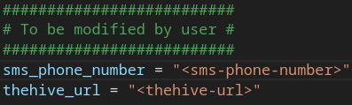

# send-SMS

## Overview

Cortex responder to send an SMS if a High or Critical TheHive alert has been created.


The SMS is sent using the `send-SMS.pl` script. The SMS messages are in the following format :

```
[On-call duty]
TheHive alert { <severity> } : <alert-title>

https://<thehive-url>/alerts/<alert-id>/details
```

## Usage

On Cortex, to enable `Send-SMS_1_0` responder, you have to add TheHive API key of your service account `api_key`.

In the Python program `send-SMS.py`, change this variables :



- **\<sms-phone-number>** - Phone number to which the SMS will be sent
- **\<thehive-url>** - URL of your TheHive platform

## Configuration

### Execution mode

Responder triggering should be configured automatically.

On your TheHive platform, go to "**Organization**" > "**\<organization-name>**" > "**Notifications**" menu and create a notification named "Send SMS". Add the following data shown in the screenshot below :


### Customization

In the Python program `send-SMS.py`, modify `sms_text` variable to customize SMS message.