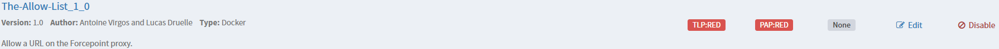
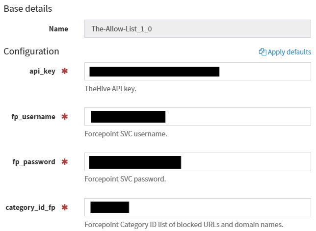

# the-allow-list

*Co-created with [Lucas Druelle](https://www.linkedin.com/in/lucas-druelle).*

Cortex responder to allow a URL or a domain name on the Forcepoint proxy.



## Prerequisites

```bash
pip install -r requirements.txt
```

- Cortex on your TheHive instance
- TheHive API key of your service account
- Proxy settings (optional)
- Forcepoint Policy Server

## Usage

> **ℹ️ Note**  
> We recommend that you create a custom category to store the URLs and domains to be blocked. Note the identifier (a numeric value) assigned to your custom category.

In the Python program `the-allow-list.py`, update the following global variables: 

```py
# TheHive instance URL
THEHIVE_API_URL = "https://<thehive>/api/v1"

# Forcepoint Policy Server API URL
FORCEPOINT_API_URL = "https://<policy-server>:15873/api/web/v1/categories"
```

On Cortex, go to "**Organization**" > "**Responders**" and select the responder "**The-Allow-List**". Enter the following parameters:


